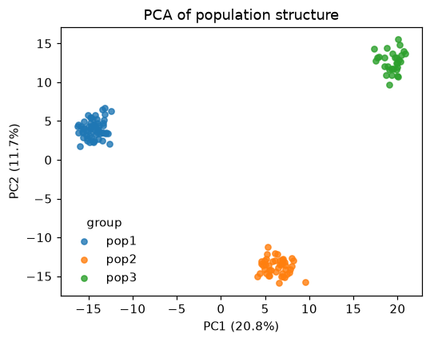
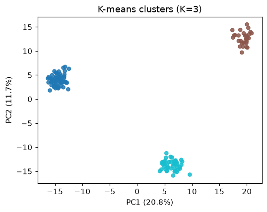
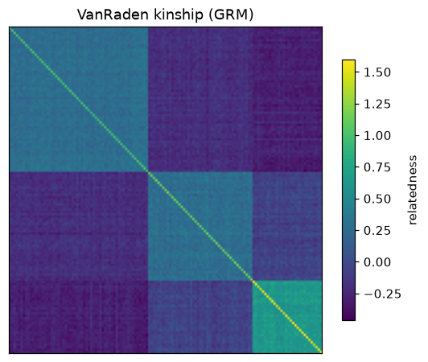
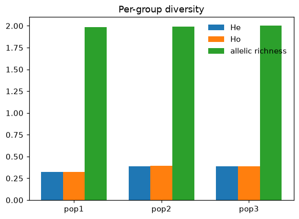
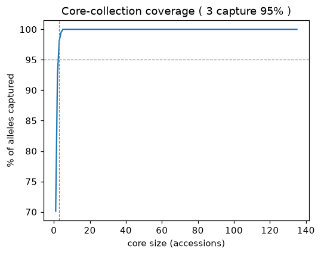
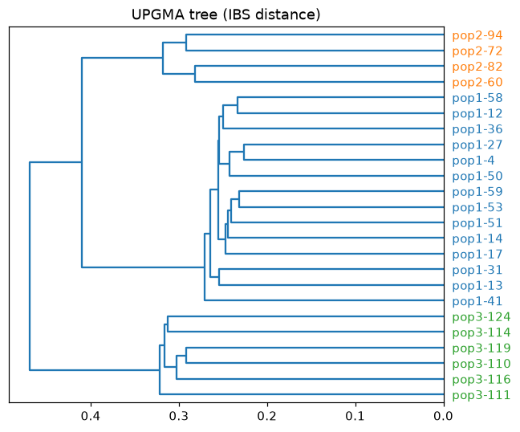

<p align="center">
  
</p>

# Gigwa MCP Server

An [MCP](https://modelcontextprotocol.io) server that drives a local or remote
[Gigwa](https://github.com/SouthGreenPlatform/Gigwa2) installation over its REST API.
It lets an MCP client (Claude Desktop / Claude Code) run the whole genotyping workflow
in plain language: **connect → import genotype data & metadata → run QC and diversity
analyses → audit databases for import artifacts**. Built for genomic-resources teams and
genebanks, but works with any Gigwa instance.

- **Import** DArTseq SNP/Silico xlsx reports (with correct 2-row genotype calling) or
  plain VCF, plus per-individual metadata.
- **Analyse** read-only: genotypes are pulled out of Gigwa and all statistics are
  computed in Python (scikit-allel / numpy / scipy). Nothing is written back.
- **Audit** an existing instance to find databases that were imported badly.
- Every analysis returns a chat summary and writes full tables as CSV under
  `./gigwa_results/<database>/`.

## Table of contents

- [Gigwa MCP Server](#gigwa-mcp-server)
  - [Table of contents](#table-of-contents)
  - [Overview](#overview)
  - [Features](#features)
  - [How it works](#how-it-works)
  - [Requirements](#requirements)
  - [Installation](#installation)
    - [Add it to Claude Code (the simple version)](#add-it-to-claude-code-the-simple-version)
  - [Configuration](#configuration)
  - [Connecting from an MCP client](#connecting-from-an-mcp-client)
  - [Quick start](#quick-start)
  - [Tool reference](#tool-reference)
  - [Usage scenarios](#usage-scenarios)
  - [Output files](#output-files)
  - [Visualizing results](#visualizing-results)
    - [PCA: `pca_coords.csv`](#pca-pca_coordscsv)
    - [Population structure: `structure_clusters.csv`](#population-structure-structure_clusterscsv)
    - [Kinship: `kinship_matrix.csv`](#kinship-kinship_matrixcsv)
    - [Per-group diversity: `diversity_by_group.csv`](#per-group-diversity-diversity_by_groupcsv)
    - [Core-collection coverage: `core_collection.csv`](#core-collection-coverage-core_collectioncsv)
    - [UPGMA tree: `tree.nwk`](#upgma-tree-treenwk)
  - [Performance \& scaling](#performance--scaling)
  - [Limitations \& disadvantages](#limitations--disadvantages)
  - [Troubleshooting](#troubleshooting)
  - [DArTseq notes](#dartseq-notes)
    - [Genomic positions (optional)](#genomic-positions-optional)
  - [Project layout](#project-layout)
  - [Testing](#testing)
  - [License \& contributing](#license--contributing)

## Overview

Gigwa is a web platform for storing and querying genotyping data. Loading data into it
and getting analyses out is normally manual (massaging xlsx into Gigwa's import format,
clicking through the web UI, uploading .dart/.vcf, exporting VCFs, running pop-gen tools separately).

This server exposes Gigwa as a set of **MCP tools**. You talk to your MCP client in
natural language; it picks the matching tool and fills in the arguments. There is no
chat API of its own, meaning the "interface" is the tool list below plus your prompts.

The analysis tools are read-only: they extract genotypes (via async VCF export or
paged BrAPI `allelematrix`), compute everything in Python, and write CSVs locally. They
never modify the data in Gigwa.

## Features

**Import pipeline**

| Tool | What it does |
|------|--------------|
| `gigwa_server_info` | Verify connectivity/auth and report the server version |
| `list_content` | List databases → projects → runs on the instance |
| `import_dartseq` | Call genotypes from DArTseq SNP/Silico xlsx report(s) → VCF and import (optionally genome-anchored via `reference_fasta`) |
| `import_vcf` | Import a `.vcf` / `.vcf.gz` (any technology) |
| `map_dartseq_to_reference` | Align DArT tag sequences to a reference genome to infer each marker's chromosome/position |
| `validate_metadata` | Validate an individual-metadata TSV without importing |
| `import_metadata` | Import per-individual attributes into a database |
| `get_import_progress` | Poll a running import by its progress token |

**QC & diversity (read-only)**

| Tool | What it does |
|------|--------------|
| `qc_call_rate` | Per-sample & per-marker call rate; flag low-call samples/markers |
| `qc_heterozygosity` | Per-sample Ho; flag outliers (contamination / off-type / selfed) |
| `qc_duplicate_accessions` | Pairwise IBS → group duplicate/clonal accessions |
| `qc_maf_filter` | Report markers that MAF / missingness filters would remove |
| `diversity_summary` | Per-marker MAF, He, Ho, PIC, Fis + dataset means |
| `diversity_pca` | PCA of population structure; variance explained + PC coords (optional `group` column) |
| `diversity_kinship` | VanRaden genomic relationship (kinship) matrix |
| `diversity_fst` | Pairwise Weir & Cockerham Fst between groups |
| `diversity_by_group` | Per-population He, Ho, Fis, MAF, % polymorphic + (rarefied) allelic richness |
| `diversity_core_collection` | Greedy allele-coverage core: smallest accession set capturing the most diversity |
| `diversity_structure` | Lightweight ancestry with PCA + K-means, pseudo-F suggests K (no ADMIXTURE binary) |
| `diversity_tree` | UPGMA dendrogram of accessions from IBS distance, written as Newick (`tree.nwk`) |

**Import-quality audit**

| Tool | What it does |
|------|--------------|
| `audit_import_quality` | Scan a whole instance (or one run) for genotype-encoding artifacts left by a bad import; rank runs BROKEN / SUSPECT / OK |

## How it works

```
MCP client (Claude Desktop / Code)
        │  natural language → tool call
        ▼
  gigwa_mcp (this server, stdio)
        │  GigwaClient: token auth, multipart upload, async progress, BrAPI v2
        ▼
     Gigwa REST API  ──►  genotypes (async VCF export  ‖  paged search/allelematrix)
        │
        ▼
  scikit-allel / numpy / scipy  →  chat summary + CSV under ./gigwa_results/<module>/
```

Analyses load genotypes through `gigwa_mcp/analysis/genotypes.py:load_genotypes`, which
has two backends:

- **`method="vcf"` (default)** : exports the whole variant set once via async VCF and
  caches it on disk for reuse. Best for small/medium sets and when you will run several
  tools on the same run.
- **`method="allelematrix"`** : pages the genotype matrix via BrAPI
  `search/allelematrix`, honouring a server-side `max_markers` subset and sizing pages to
  the server's per-response cell cap, and caches the result in-process per `(variant set,
  caps)` so repeat tool calls reuse it. Best for large datasets where a full export is
  wasteful (see [Performance & scaling](#performance--scaling)).

Variant sets are addressed by their BrAPI `variantSetDbId`, of the form
`MODULE§projectNumber§run` (e.g. `MyDatabase§1§run1`). `list_content` shows them.

## Requirements

- **Python ≥ 3.10**
- **[`uv`](https://docs.astral.sh/uv/) (provides the `uvx` command)** is required if you launch
  the server with `uvx gigwa-mcp` (the recommended MCP-client setup below). Not needed if you
  `pip`/`pipx`-install the package and point your client at the resulting executable instead.
  Install it with `curl -LsSf https://astral.sh/uv/install.sh | sh` (macOS/Linux) or
  `pip install uv`, then make sure `uvx` is on your `PATH` (see the note below).
- A reachable **Gigwa** server (local or remote) and credentials.
- Optional: the **minimap2** CLI on `PATH` for DArTseq genome-anchoring of very large
  genomes (otherwise the in-process `mappy` binding is used).
- Optional: the **`[viz]`** extra (matplotlib) to run the plotting recipes / regenerate
  the example figures.

Core Python dependencies (installed automatically): `mcp`, `httpx`, `pandas`, `openpyxl`,
`numpy`, `python-dotenv`, `scikit-allel`, `scipy`, `mappy`.

## Installation

**From PyPI** (recommended):

```bash
pip install gigwa-mcp                # core + analysis (scikit-allel/scipy)
pip install "gigwa-mcp[viz]"         # + matplotlib, for the plotting recipes
```

Or run it without installing into your environment using [pipx](https://pipx.pypa.io/)
or [uv](https://docs.astral.sh/uv/) which is handy as the `command` in an MCP client config
(see below):

```bash
pipx install gigwa-mcp        # then: gigwa-mcp
uvx gigwa-mcp                 # run on demand, no install step
```

**From source** (for development or an unreleased version):

```bash
git clone https://github.com/gkanogiannis/Gigwa-MCP.git gigwa-mcp && cd gigwa-mcp
python -m venv venv && source venv/bin/activate
pip install -e .            # core + analysis (scikit-allel/scipy)
pip install -e ".[dev]"     # + pytest, to run the test suite
pip install -e ".[viz]"     # + matplotlib, for plotting recipes / example figures
```

Run the stdio server directly to smoke-test:

```bash
python -m gigwa_mcp         # or: gigwa-mcp
```

(Normally you don't run it by hand as your MCP client launches it; see below.)

### Add it to Claude Code (the simple version)

Think of this as plugging a new tool into Claude Code so you can just *talk* to your Gigwa
server. You do it once, with a single command without editting any files by hand.

1. **Install [`uv`](https://docs.astral.sh/uv/), which provides the `uvx` command.** It's a
   small helper that downloads and runs `gigwa-mcp` for you, so you don't have to install
   anything else first:

   ```bash
   curl -LsSf https://astral.sh/uv/install.sh | sh   # macOS / Linux
   # or, on Windows PowerShell:
   #   powershell -ExecutionPolicy ByPass -c "irm https://astral.sh/uv/install.ps1 | iex"
   # or, if you already have Python/pip:
   #   pip install uv
   ```

   Then confirm it's reachable: `uvx --version` should print a version. If it says
   "command not found", `uvx` isn't on your `PATH` yet, then see the note below. (If you'd
   rather not use `uv` at all, `pipx install gigwa-mcp` works too; then use `gigwa-mcp`
   in place of `uvx gigwa-mcp` everywhere below.)

2. **Run this one command** in your terminal, swapping in your own Gigwa address, username,
   and password:

   ```bash
   claude mcp add gigwa --scope user \
     -e GIGWA_URL=http://localhost:8080/gigwa \
     -e GIGWA_USER=your_user \
     -e GIGWA_PASS=your_password \
     -- uvx gigwa-mcp
   ```

   What the pieces mean, in plain words:
   - `gigwa` : the nickname you're giving this tool.
   - `--scope user` : "make it available in all my projects" (use `--scope project` instead
     to share it with your team via a `.mcp.json` file in the repo).
   - the three `-e` lines : your Gigwa address and login, handed to the tool privately.
   - everything after `--` : the command that actually starts the server (`uvx gigwa-mcp`).

3. **Check it worked.** In Claude Code, type `/mcp`. You should see **gigwa** listed.

4. **Just ask.** Try: *"Is my Gigwa up, and what version?"* or *"List the databases."*
   Claude picks the right tool and fills in the details for you.

> **Note that `uvx` must be on your client's `PATH`.** If `/mcp` shows the server as
> **failed** with `Executable not found in $PATH: "uvx"`, the MCP client couldn't find
> `uvx`. The `uv` installer drops `uvx` in `~/.local/bin` (or `~/.cargo/bin`); make sure
> that directory is on the `PATH` of the shell/app that launches Claude (restart the app
> or your terminal after installing). As a workaround you can point the config at the
> absolute path (`"command": "/home/you/.local/bin/uvx"`), or avoid `uvx` entirely by
> `pipx install gigwa-mcp` and using `gigwa-mcp` as the `command`.

## Configuration

Connection settings come from the environment, optionally seeded from a `.env` file in
the working directory or any parent (`cp .env.example .env` and edit):

```dotenv
GIGWA_URL=http://localhost:8080/gigwa
GIGWA_USER=your_user
GIGWA_PASS=your_password
# GIGWA_TIMEOUT=120   # optional, seconds
```

`GIGWA_URL` is the Gigwa base URL **without** the `/rest` suffix (it is appended
automatically). The target Gigwa may be local or remote. `.env` files are gitignored;
keep credentials out of version control.

## Connecting from an MCP client

Add a stdio server entry (Claude Desktop `claude_desktop_config.json` or Claude Code MCP
settings). If you `pip install`ed into a venv, point `command` at that venv's
`gigwa-mcp`; with [uv](https://docs.astral.sh/uv/) you can have it fetch and run the
published package on demand with no separate install:

```json
{
  "mcpServers": {
    "gigwa": {
      "command": "uvx",
      "args": ["gigwa-mcp"],
      "env": {
        "GIGWA_URL": "http://localhost:8080/gigwa",
        "GIGWA_USER": "your_user",
        "GIGWA_PASS": "your_password"
      }
    }
  }
}
```

Or with an explicit interpreter path (`"command": "/abs/path/to/venv/bin/gigwa-mcp"`,
no `args`) if you installed it into a virtual environment.

Credentials live in this config, so there is no per-chat "connect" step and every tool call
authenticates on its own (token generated and refreshed automatically). To drive
several Gigwa servers, register one entry each (e.g. `gigwa-local`, `gigwa-remote`)
with its own `GIGWA_URL`/credentials and name the one you mean in the prompt.

## Quick start

You talk to your MCP client in plain language; it calls the matching tool and fills in
arguments (paths, thresholds, module names) from what you say. A typical first session:

| You ask | Tool called |
|---------|-------------|
| "Is my Gigwa up, and what version?" | `gigwa_server_info` |
| "Connect and list the databases." | `list_content` |
| "Import `report_snps.xlsx` into a new database `MYDB`, anchored to `reference.sr.mmi`." | `import_dartseq(..., reference_fasta=...)` |
| "Now run call-rate QC and a PCA on that run." | `qc_call_rate` → `diversity_pca` |
| "Scan the whole instance for badly imported databases." | `audit_import_quality` |

More example prompts:

| You ask | Tool called |
|---------|-------------|
| "Load this VCF into project `trial1`." | `import_vcf` |
| "Validate then import this individual-metadata TSV." | `validate_metadata` → `import_metadata` |
| "Find duplicate / clonal accessions." | `qc_duplicate_accessions` |
| "Flag heterozygosity outliers (contamination / off-types)." | `qc_heterozygosity` |
| "Which markers would a MAF 5% / 50%-missing filter drop?" | `qc_maf_filter` |
| "Give me per-marker MAF, He, Ho, PIC." | `diversity_summary` |
| "Compute the kinship matrix." | `diversity_kinship` |
| "Compute Fst between these two groups of accessions." | `diversity_fst` |
| "Compare diversity (He/Ho/allelic richness) across my populations." | `diversity_by_group` |
| "Pick a core collection of ~10% that captures the most diversity." | `diversity_core_collection` |
| "How many genetic clusters are in this collection?" | `diversity_structure` |
| "Build a UPGMA tree of the accessions." | `diversity_tree` |

## Tool reference

All variant-set tools take `variant_set_db_id` (`MODULE§projectNumber§run`). QC/diversity
tools also accept `output_dir` (defaults to `./gigwa_results/<module>/`) and the scaling
args `max_markers` / `method` (`"vcf"` | `"allelematrix"`); see
[Performance & scaling](#performance--scaling).

**Connection & import**

| Tool | Key arguments | Returns / writes |
|------|---------------|------------------|
| `gigwa_server_info` | (none) | server version + auth check |
| `list_content` | (none) | database → project → run hierarchy |
| `import_dartseq` | `snp_xlsx?`, `silico_xlsx?`, `module`, `project`, `run`, `ploidy=2`, `reference_fasta?`, `positions_csv?`, `wait=True` | imports a DArTseq report; marker/sample counts + final status |
| `import_vcf` | `vcf_path`, `module`, `project`, `run`, `ploidy=2`, `wait=True` | imports a `.vcf`/`.vcf.gz` |
| `map_dartseq_to_reference` | `snp_xlsx`, `reference_fasta`, `min_mapq`, `backend="auto"` | `dartseq_positions.csv` (chrom/pos/strand per marker) |
| `validate_metadata` | `tsv_path`, `module`, `metadata_type="Individual"` | validation issues (no import) |
| `import_metadata` | `tsv_path`, `module`, `metadata_type="Individual"` | imports per-individual attributes |
| `get_import_progress` | `progress_token` | current async-job status |

**QC & diversity** (output files listed in [Output files](#output-files))

| Tool | Key arguments | Flags / interprets |
|------|---------------|--------------------|
| `qc_call_rate` | `min_sample_call_rate=0.5`, `min_marker_call_rate=0.5` | samples/markers below threshold |
| `qc_heterozygosity` | `outlier_sd=3.0` | Ho outliers; warns if cohort mean Ho implausibly high |
| `qc_duplicate_accessions` | `similarity_threshold=0.95`, `max_markers=5000` | duplicate/clone groups; warns on degenerate clustering |
| `qc_maf_filter` | `maf_threshold=0.05`, `max_missing=0.5` | counts monomorphic / low-MAF / high-missing markers |
| `diversity_summary` | (none) | dataset means; warns on strongly negative Fis |
| `diversity_pca` | `n_components=10`, `outlier_sd=6.0`, `metadata_tsv?`, `group_column?` | variance explained + PC1/PC2 outliers |
| `diversity_kinship` | `top_pairs=15` | mean off-diagonal, top related pairs, inbreeding diagonal |
| `diversity_fst` | `groups_json?` **or** `metadata_tsv`+`group_column`, `id_column="individual"` | pairwise Fst |
| `diversity_by_group` | `groups_json?` / `metadata_tsv`+`group_column` | per-group He/Ho/Fis/MAF/%poly/allelic richness |
| `diversity_core_collection` | `size?` **or** `fraction=0.1` | core set + % of diversity captured |
| `diversity_structure` | `k_min=2`, `k_max=10` | suggested K (pseudo-F) + per-K table; warns on degenerate clustering |
| `diversity_tree` | `max_markers=5000` | UPGMA Newick (`tree.nwk`) |

**Audit**

| Tool | Key arguments | Returns / writes |
|------|---------------|------------------|
| `audit_import_quality` | `variant_set_db_id?` (omit = whole instance), `max_markers=1000`, `max_samples=300`, thresholds | ranked BROKEN/SUSPECT/OK + `import_quality_scan.csv` |

## Usage scenarios

**A. Import a DArTseq report, genome-anchored.** Map the tag sequences once, inspect, then
import reusing the positions:
> "Where do these DArT markers sit on the *X* genome at `reference.sr.mmi`?" → `map_dartseq_to_reference`
> "Looks good, import `report_snps.xlsx` into `MYDB` reusing that mapping." → `import_dartseq(..., positions_csv=...)`

**B. Vet an instance you inherited.** Before trusting any analysis, triage every run for
encoding artifacts:
> "Scan my whole Gigwa for databases that were imported badly." → `audit_import_quality`
Runs are ranked BROKEN / SUSPECT / OK with reasons, and the full table lands in
`import_quality_scan.csv`.

**C. Genebank cleaning.** Classic data-cleaning sweep on one run:
> "Check call rates, flag heterozygosity outliers, and find duplicate accessions in `MYDB§1§run1`."
→ `qc_call_rate` → `qc_heterozygosity` → `qc_duplicate_accessions`.

**D. Diversity & structure study.**
> "Give me a diversity summary, a PCA, the number of clusters, and a UPGMA tree for `MYDB§1§run1`."
→ `diversity_summary` → `diversity_pca` → `diversity_structure` → `diversity_tree`.

**E. Build a core collection.**
> "Pick a core of ~10% of accessions that captures the most allelic diversity." → `diversity_core_collection(fraction=0.1)`.

**F. Population comparisons from metadata.** Provide a metadata TSV with a grouping column
(e.g. `country`, `population`):
> "Using `meta.tsv` grouped by `population`, compare per-group diversity and compute pairwise Fst."
→ `diversity_by_group(metadata_tsv="meta.tsv", group_column="population")` → `diversity_fst(...)`.

## Output files

Each analysis writes one or more CSVs (Newick for the tree) under
`./gigwa_results/<module>/` (the audit writes to `./gigwa_results/`):

| File | Written by | Contents |
|------|------------|----------|
| `call_rate_samples.csv` / `call_rate_markers.csv` | `qc_call_rate` | per-sample / per-marker call rate + flags |
| `heterozygosity_samples.csv` | `qc_heterozygosity` | per-sample Ho, z-score, flag |
| `duplicate_pairs.csv` / `duplicate_groups.csv` | `qc_duplicate_accessions` | IBS pairs ≥ threshold, grouped |
| `marker_filter_stats.csv` | `qc_maf_filter` | per-marker MAF, missingness, would-remove flags |
| `diversity_markers.csv` | `diversity_summary` | per-marker MAF, He, Ho, PIC |
| `pca_coords.csv` | `diversity_pca` | per-sample PC coords (+ optional `group`, `outlier`) |
| `kinship_matrix.csv` | `diversity_kinship` | samples × samples GRM |
| `fst_pairwise.csv` | `diversity_fst` | Fst for every group pair |
| `diversity_by_group.csv` | `diversity_by_group` | per-group He/Ho/Fis/MAF/%poly/allelic richness |
| `core_collection.csv` | `diversity_core_collection` | rank, accession, cumulative allele coverage |
| `structure_clusters.csv` | `diversity_structure` | per-sample cluster + PC coords |
| `tree.nwk` | `diversity_tree` | UPGMA tree (Newick) |
| `import_quality_scan.csv` | `audit_import_quality` | one row per run: status + diagnostics + reasons |
| `dartseq_positions.csv` | `map_dartseq_to_reference` | per-marker chrom/pos/strand/mapq/status |

## Visualizing results

The tools output tables, not images, which keeps them composable. The figures below were
produced from a **synthetic** dataset by `docs/make_example_figures.py` (run
`pip install -e ".[viz]" && python docs/make_example_figures.py` to regenerate). The same
recipes work on the real CSVs the tools write.

### PCA: `pca_coords.csv`

```python
import pandas as pd, matplotlib.pyplot as plt
df = pd.read_csv("gigwa_results/MYDB/pca_coords.csv")
groups = df["group"] if "group" in df else pd.Series("all", index=df.index)
for g, sub in df.groupby(groups):
    plt.scatter(sub.PC1, sub.PC2, s=20, label=g)
plt.xlabel("PC1"); plt.ylabel("PC2"); plt.legend(); plt.savefig("pca.png")
```

### Population structure: `structure_clusters.csv`

```python
df = pd.read_csv("gigwa_results/MYDB/structure_clusters.csv")
plt.scatter(df.PC1, df.PC2, c=df.cluster, cmap="tab10", s=20)
plt.xlabel("PC1"); plt.ylabel("PC2"); plt.title("K-means clusters"); plt.savefig("structure.png")
```

### Kinship: `kinship_matrix.csv`

```python
g = pd.read_csv("gigwa_results/MYDB/kinship_matrix.csv", index_col=0)
plt.imshow(g.values, cmap="viridis"); plt.colorbar(label="relatedness"); plt.savefig("kinship.png")
```

### Per-group diversity: `diversity_by_group.csv`

```python
d = pd.read_csv("gigwa_results/MYDB/diversity_by_group.csv").set_index("group")
d[["he", "ho", "allelic_richness"]].plot.bar(); plt.tight_layout(); plt.savefig("by_group.png")
```

### Core-collection coverage: `core_collection.csv`

```python
c = pd.read_csv("gigwa_results/MYDB/core_collection.csv")
plt.plot(c["rank"], c["coverage_fraction"] * 100)
plt.xlabel("core size"); plt.ylabel("% alleles captured"); plt.savefig("core.png")
```

### UPGMA tree: `tree.nwk`


`tree.nwk` is standard Newick; open it directly in [FigTree](http://tree.bio.ed.ac.uk/software/figtree/)
or [iTOL](https://itol.embl.de/), or render in Python:
```python
from Bio import Phylo            # pip install biopython
Phylo.draw(Phylo.read("gigwa_results/MYDB/tree.nwk", "newick"))
```

## Performance & scaling

- **Small/medium runs:** the default `method="vcf"` exports once and caches; running
  several tools on the same run reuses the cached genotypes.
- **Large runs (hundreds of thousands of markers):** pass `method="allelematrix"` with a
  `max_markers` cap (e.g. 2000-20000) so genotypes are sampled **server-side** instead of
  exporting a multi-GB VCF. Statistics are estimated from the sample.
- **Many samples (thousands):** the server caps each `allelematrix` response at ~10,000
  cells, so at *N* samples a response holds ~`10000/N` markers, i.e. requests scale with
  `max_markers`. Keep `max_markers` modest on high-sample-count sets.
- **O(samples²) tools:** `diversity_kinship`, `qc_duplicate_accessions`, and
  `diversity_tree` build a samples × samples matrix (and the kinship CSV is written in
  full). Subsample markers and expect large output / slower runs beyond a few thousand
  accessions.
- The `audit_import_quality` tool is bounded by `max_markers` × `max_samples` per run, so
  it is cheap and roughly constant-cost even across a whole production instance.

## Limitations & disadvantages

- **Read-only analysis.** QC/diversity/audit never write results back to Gigwa; you get
  CSVs locally. (Import tools do write to Gigwa.)
- **No built-in plotting.** Tools emit CSV/Newick; use the
  [recipes above](#visualizing-results) (matplotlib/Bio.Phylo) to make figures.
- **`diversity_structure` is a lightweight heuristic.** It is PCA + K-means with a
  pseudo-F (Calinski-Harabasz) K suggestion; there is no true admixture model. On weakly
  or continuously structured data pseudo-F tends toward `k_max`; the per-K table is the
  real output and the tool warns when clustering is degenerate. For formal ancestry use a
  dedicated tool (ADMIXTURE / sNMF) on an exported VCF.
- **Diploid-biallelic assumptions** in places (IBS dosage 0/1/2, collapsed-token decode).
- **Grouping uses a metadata TSV, not server attributes.** Some Gigwa builds do not expose
  BrAPI germplasm/sample/attribute endpoints, so `diversity_fst` / `diversity_by_group`
  take groups from `groups_json` or a metadata TSV rather than querying Gigwa.
- **VCF export downloads the whole variant set** regardless of `max_markers`; use
  `method="allelematrix"` to subsample large sets.
- **Genome anchoring needs minimap2 + a reference**, and streaming very large indexes is
  I/O-bound.
- **Single-threaded Python compute**; large matrices are held in RAM.

## Troubleshooting

- **Auth / "Missing required environment variable(s)".** Ensure `GIGWA_URL`, `GIGWA_USER`,
  `GIGWA_PASS` are set (env or `.env`). `GIGWA_URL` must **omit** the `/rest` suffix.
- **VCF import rejected / "not bgzipped".** Gigwa needs BGZF, not plain gzip. Recompress:
  `gunzip -c f.vcf.gz | bgzip > f.bgz.vcf.gz` (htslib `bgzip`).
- **Implausible ~95% heterozygosity after a DArT import.** That is Gigwa's built-in DArT
  parser mis-calling the 2-row format. Use `import_dartseq` (it calls genotypes in Python
  and imports a standard VCF) instead of importing the raw DArT report (see below).
- **`diversity_fst` / `diversity_by_group` report "no groups matched".** Check that
  `id_column` values in your TSV match the accession names (or callset ids) in the run.
- **Large set feels slow.** Use `method="allelematrix"` + a smaller `max_markers`, and
  avoid the O(samples²) tools on many thousands of accessions.

## DArTseq notes

DArTseq SNP reports use the classic 2-rows-per-marker layout (a reference-allele row and a
SNP-allele row, each cell `1`/`0`/`-`); Silico-DArT reports are 1 row per clone (dominant
presence/absence). `import_dartseq` does the genotype calling in Python and emits a
standard VCF, imported through Gigwa's verified VCF path:

```
(ref=1, alt=0) -> 0/0   (ref=0, alt=1) -> 1/1
(ref=1, alt=1) -> 0/1   otherwise      -> ./.   (missing / no allele detected)
```

This deliberately bypasses Gigwa's built-in DArT parser, which might mis-call the 2-row format
(there are cases that it imports reference homozygotes as heterozygous, producing implausible ~95%
heterozygosity). SNP and Silico use different allele models; import them as separate runs
unless you specifically intend to combine them.

### Genomic positions (optional)

DArTseq markers have no genomic coordinates, so by default they are placed on a single
`Unmapped` contig at sequential positions. If you have a reference genome FASTA, the marker
tag sequences (`AlleleSequence`, ~69 bp) can be aligned to it with minimap2 to infer real
chromosome/position/strand:

- `map_dartseq_to_reference(snp_xlsx, reference_fasta)` → a `dartseq_positions.csv` report
  (uniquely mapped / multi / unmapped), for inspection.
- `import_dartseq(..., reference_fasta=...)` → imports uniquely-mapped markers
  genome-anchored (minus-strand alleles complemented, output coordinate-sorted, one marker
  per genomic site); unmapped markers stay on `Unmapped`.
- `import_dartseq(..., positions_csv=...)` → reuse a `dartseq_positions.csv` from a previous
  run instead of re-aligning. Recommended for large genomes: align once, inspect, then
  import without paying the alignment cost again.

`reference_fasta` may be a FASTA (`.fa`/`.fa.gz`) or a prebuilt minimap2 `.mmi` index. By
default the **minimap2 CLI** backend is used when available: it streams over multi-part
indexes with bounded RAM, so very large (multi-gigabase) genomes work on modest machines.
The in-process `mappy` backend (`backend="mappy"`) loads the whole index into RAM instead.

Prebuild an index once (tuned for the ~69 bp tags) and reuse it:

```bash
minimap2 -x sr -d reference.sr.mmi reference.fasta   # build once
# then pass reference.sr.mmi as reference_fasta
```

## Project layout

```
gigwa_mcp/
  __main__.py           # python -m gigwa_mcp → stdio server
  config.py             # .env / env loading (GIGWA_URL/USER/PASS/TIMEOUT)
  client.py             # GigwaClient: auth, multipart upload, progress, BrAPI calls
  server.py             # FastMCP instance + get_client()
  importers/
    dartseq.py          # DArTseq xlsx → standard VCF (2-row genotype calling)
    refmap.py           # minimap2 tag → reference mapping
  analysis/
    genotypes.py        # load_genotypes (VCF / allelematrix backends), GenotypeMatrix
    stats.py            # pure pop-gen stats (MAF, He, PIC, IBS, GRM, allelic richness …)
    genebank.py         # core-collection + UPGMA helpers
    results.py          # output-dir resolution + CSV writing
  tools/                # @mcp.tool() wrappers: connection, genotype, metadata, qc,
                        #   diversity, audit
scripts/                # run_import_audit.py, run_qc_diversity_validation.py (generic)
docs/                   # make_example_figures.py + img/ (README figures)
tests/                  # pytest suite (mocked client + synthetic fixtures)
```

## Testing

```bash
pip install -e ".[dev]"
pytest
```

`test_client.py` covers auth/token-refresh, multipart assembly and progress polling with a
mocked transport; `test_dartseq_convert.py` checks the conversion against synthetic
SNP/Silico fixtures; `test_stats.py` / `test_genebank.py` verify the pop-gen and genebank
statistics against hand-computed values; `test_genotypes.py` exercises VCF parsing +
callset-name mapping with a mock client. The suite needs no live Gigwa server.

## License & contributing

Released under the [Apache License 2.0](LICENSE) © 2026 Anestis Gkanogiannis
<anestis@gkanogiannis.com> (see also [NOTICE](NOTICE)).

Issues and pull requests are welcome. Please run `pytest` before submitting, keep new
analysis logic in pure, unit-tested helpers under `gigwa_mcp/analysis/`, and avoid
committing data, credentials, or result files (these are gitignored).
